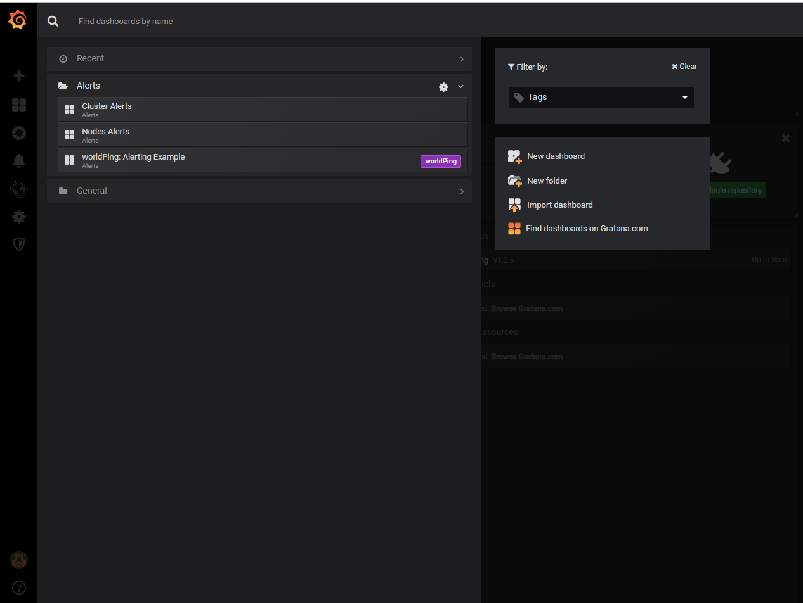
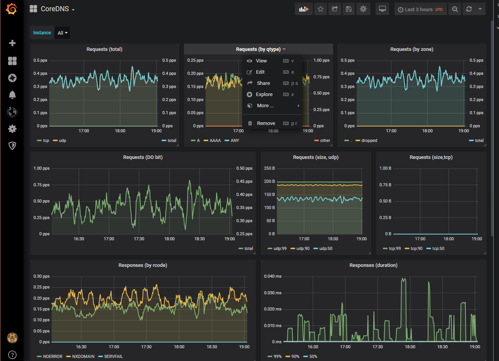
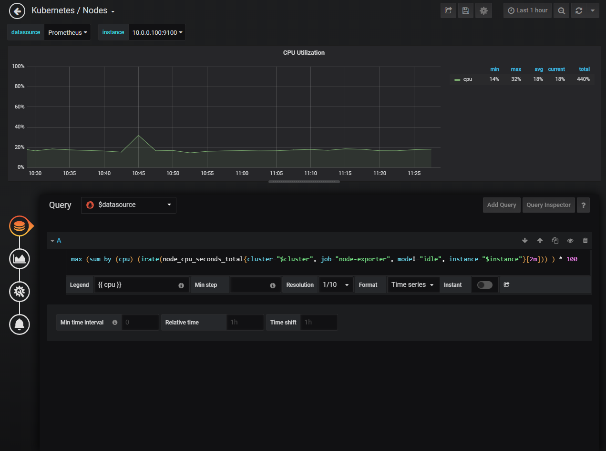
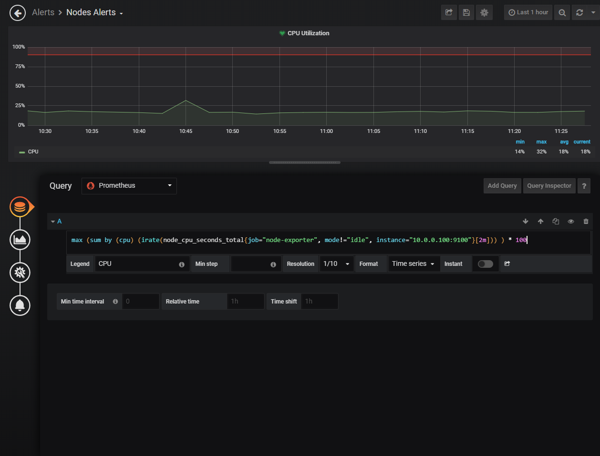
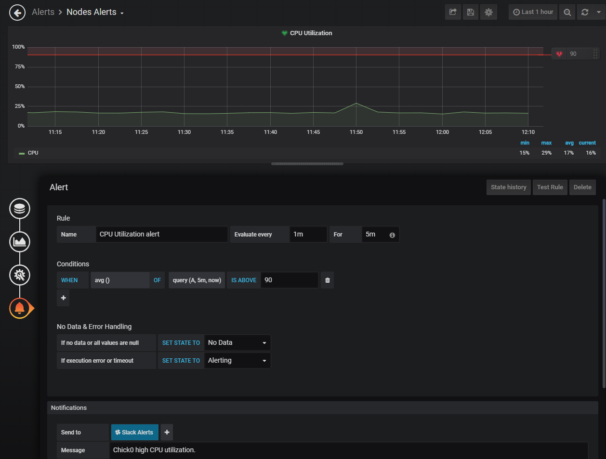

# Bare Metal Stuff

This is everything that we need to know to work on the baremetal kubernetes
cluster.

# Summary

1. [Introduction](#Introduction)
1. [Roadmap](#Roadmap)
1. [Networking](#Networking)
1. [Publishing Services](#Publishing-Services)
1. [Netbooting](#Netbooting)
1. [Adding Nodes](#Adding-Nodes)
1. [Installing JupyterHub and BinderHub](#Installing-JupyterHub-and-BinderHub)
1. [Accessing the Cluster](#Accessing-the-Cluster)
1. [Monitoring the Cluster](#Monitoring-the-Cluster)
1. [Alerting for the Cluster](#Alerting-for-the-Cluster)
1. [Securing the Cluster](#Securing-the-Cluster)
1. [Literature List](#Literature-List) for learning resources.
1. [Useful Commands](#Useful-Commands)

# Introduction
This guide is organized in a way so one could build a Kubernetes cluster running JupyterHub
from the beginning. We suggest reading more about Kubernetes first; there are some
sources from the [Literature List](#Literature-List) section you could follow.

## Management Node

In the rest of the docs, we may refer to the management node by its hostname,
rooster.

This node is not part of the kubernetes cluster, but acts as a gateway to the
Internet, runs a dhcp server, and hosts the network boot stuff.

## Standard Nodes

We are calling the basic nodes chicks. These will be our masters and workers in
the kubernetes cluster.

Each has hostname `chick{i}` where i is a natural number.

Currently have `chick0` through `chick10` so 11 in total.

Assinging static IPs for `chick{i}` of `10.0.0.{i + 100}`. So `chick0` will be
at `10.0.0.100` and `chick1` at `10.0.0.101`, etc.

## Testing

To test out your cluster, try running a [test deployment](
https://github.com/kubernetes/examples/blob/master/staging/simple-nginx.md)
and see if you can access the server from every node. Or if you can access the
public ip assigned by metalc from outside the network if you publish as type
loadbalancer.

# Roadmap

Basically, a todo list for the cluster and our development plan for the future.

# Minimum Requirements

## On-Premis Requirements

This is stuff that needs to be done before all work can be done remotely.

- rack all servers and nfs server (remember to put RAM in all servers)
- put disks in the servers
- install OS (can only be done after disks are in)
- wiring for the networking
- networking -- though this technically can be done remotely, we might break
  something while doing it so we should do it on-premis.
  - write down the MAC addresses for the interfaces we use on all the nodes.
    We might also want to assign each node a static IP in our private network
    by changing the dhcp configuration on our management node.
  - pod network fabric
  - metallb (metal load balancer. See below)

## Kubernetes Install

Using kubeadm with the Ansible playbook to install everything. Right now this works in the dev-env,
but we need to get it to bare metal. Preferably set it up so we can use the same playbook for both
the development environment and the actual metal one.

## Network Fabric

We need to set up the network fabric in some way. Flannel is working in dev-env, but it has
a lot of overhead because it uses ip tunneling. Something to consider is Calico, but we may
need some more complicated config

## Persistent Volume Provisioner

This is where we will talk to the nfs server to allow for persistent volumes. It shouldn't be
that different from the nfs-client setup we have in dev-env.

We can either create a default Storage Class, but it would be more secure and give us finer
grained control if we configured all of them manually by passing values to the jupyterhub Helm
chart. In this way we can allow for different persistence and rules within the same cluster, but
it may not be a problem if we just namespace everything into separate namespaces.

## Load Balancer

[MetalLB](https://metallb.universe.tf) seems to be the move for this one. It makes it so when services
are published as type LoadBalancer, they still work on bare metal and IPs are provided automatically.
This seems like the best way to expose services to outside the cluster on bare metal without having
to make any modifications to the underlying helm charts.
Certainly the people at nginx ingress make this seem like the best option in [these docs](
https://kubernetes.github.io/ingress-nginx/deploy/baremetal/)

# Long(er) Term Goals
## HA masters

Down the road, we need to configure high availability masters so we aren't as vulnerable to a master
failing. The setup is outlined in the [kubeadm docs](https://kubernetes.io/docs/setup/independent/high-availability/).
We can use either [HA proxy](http://www.haproxy.org/#desc), which Richard is familiar with,
or maybe some sort of nginx proxy. Either way, we have to do this manually since this proxying
must exist before kubectl is operational.

## Cluster Helm chart

This will basically all the extra stuff we need to add to the cluster to make it feel like a cloud
environment. For instance,
  - install the dynamic nfs volume provisioner on the cluster
  - install MetalLB on cluster

## Testing

We need an automated testing framework where we can put in test to simulate a bunch of users.
Maybe this could be cool: http://jmeter.apache.org/
But we need to do more complicated things, like have the clients run
programs or make graphs.

Yuvi mentioned this and that they had a way to do so, so we should contact him when we are ready.

We also test the cluster under failure by bringing down nodes and seeing how the cluster responds

## Publicity

Once we have something fully deployed, we should put our work on the binderhub
site under the [deployments section](https://binderhub.readthedocs.io/en/latest/known-deployments.html)
becuase it says they are looking for more people to post their deployments on there.


# Networking

Here is our basic setup for the nodes (not pods yet): 
(taken from LibreTexts/Documentation/network_drawing as a saved svg)

## k8s network (internal network)

This is how all the computers will communicate with each other using kubernetes and how they will
access the internet indirectly though the manager. The manager will be a load balancer, dhcp server,
router with NAT, and our way assign IP addresses to services.

Uses blue ethernet cables. Plugged into the smart switch.

Manager is at 128.120.136.26

enp1s0 on all the machines (the one on the left but not the far left) except
the manager has it on enp3s0 which is the one as shown in the diagram above.

log into the switch with `screen /dev/ttyS0` on the management node
  - use username: manager
        password: friend

## Management Network

We will have one management node and one dumb switch for this network. The management node
will connect to it on its enp2s0(the ethernet port on the right) and its management
interface (the one all the way to the left next to the usb ports).
It will run a DHCP server on this network.
The rest of the nodes will connect to this dumb switch only on their management interface.

Uses green ethernet cables.


## Pod Network

This is the network so pods can communicate with each other. These will be running over
the k8s network

We meet the k8s [Network Policy](
https://kubernetes.io/docs/concepts/services-networking/network-policies/)
using Calico because it is faster than flannel. Alternatively, we could do it by hand
like is done in [k8s the hard way](
https://github.com/kelseyhightower/kubernetes-the-hard-way/blob/master/docs/11-pod-network-routes.md)


Using a pod CIDR of 10.244.0.0/16

Choosing calico. The manifest is in the home directory of the repo `calico.yaml`.
In this we changed:

    CALICO_IPV4_IPIP: "Never"
    CALICO_IPV4POOL_CIDER: "10.244.0.0/16"


# Netbooting

otp on the manager node

follwing a combo of mostly this:
https://wiki.debian.org/PXEBootInstall#Preface
and also
https://help.ubuntu.com/18.04/installation-guide/amd64/ch04s05.html
and a little bit of
https://linuxhint.com/pxe_boot_ubuntu_server/


Using `10.0.0.0/24` for all the node IPs (chicks) so we have the manager as the
dhcp server also at `10.0.0.1`.

### quick word on hardaware

  network booting seems to work only on the enp1s0 interface on nodes. This is
  currently the one on the left. You cannot boot on the management interface
  that is located on the far left of the machines. Furthermore, this didn't work
  initially on the smart switch, so you must make sure that there are not routes
  or something already configured that would cause unexpected behavior. You also
  need to make sure you are doing this on a private network where the manager is
  the only dhcp server.
  After they were initially booted, I was able to switch them all over to the
  smart switch and there were no problems.

### steps on rooster (i.e. commands to run on rooster to get netboot to work):

1. `sudo apt install isc-dhcp-server`

1. to `/etc/default/isc-dhcp-server` I added the line:

    INTERFACESv4="enp3s0"

  since enp3s0 is the interface that is hooked up to the management network.
  Here, we assume enp3s0 is the interface on the manager node that faces the
  internal kubernetes network.

1. to `/etc/netplan/01-netcfg.yaml`, or whatever the netplan file is I added
  the following under ethernets:

              enp3s0:
                  addresses: [192.168.0.1/24]
                  gateway4: 128.120.136.1
                  dhcp4: no
                  nameservers:
                          addresses: [192.168.0.1]

  so we get that management interface up

1. `netplan apply`

1. before changing `/etc/dhcp/dhcpd.conf` copy the current one to
  `/etc/dhcp/dhcpd.conf.backup` and set it to this
  ```conf
# the following is adapted from
# https://wiki.debian.org/PXEBootInstall#Preface
#
default-lease-time 600;
max-lease-time 7200;

allow booting;
allow bootp;

# in this example, we serve DHCP requests from 10.0.0.(3 to 253)
# and we have a router at 10.0.0.1
# these will be the name of the nodes.
subnet 10.0.0.0 netmask 255.255.255.0 {
  range 10.0.0.3 10.0.0.99; # can't have 10.0.0.100 - 10.0.0.110 because we are
                            # using those for the chicks
  option broadcast-address 10.0.0.255;
  option routers 10.0.0.1;     # this ends up being the default gateway router
                               # on the hosts. Set to the manager so we can NAT
  option domain-name-servers 128.120.136.129,128.120.136.133,128.120.136.134;
  filename "pxelinux.0";
}

group {
  next-server 10.0.0.1;                # our Server. was previously 128.120.136.1
  host tftpclient {
    filename "pxelinux.0"; # (this we will provide later)
  }
}

  ```

1. `systemctl restart isc-dhcp-server` to get the dhcp server making
  repsjournalctl -fu isc-dhcp-server

1. checked the logs with `grep DHCP /var/log/syslog` and there were some
  requests and handouts, so thats good.

1. `sudo apt install tftpd-hpa`

1. changed `/etc/default/tftpd-hpa` to have these two defaults:
  ```
  TFTP_DIRECTORY="/srv/tftp"
  TFTP_OPTIONS="--secure -vvv"
  ```
  so we listen on our management net and not on the internet.
     ^- changed this, need to change it back after testing

1. `sudo mkdir /srv/tftp`

1. `systemctl restart tftpd-hpa` and then test it

1. `wget http://archive.ubuntu.com/ubuntu/dists/bionic/main/installer-amd64/current/images/netboot/netboot.tar.gz`

1. move netboot.tar.gz into `/srv/tftp` and run `tar xvzf netboot.tar.gz` and make the contents readable with `chmod -R a+r *`

1. `systemctl restart tftpd-hpa`

1. start up the client machine and it should get to a boot screen.

### configure NAT

1. `apt get ufw`

1. add the following to `/etc/ufw/before.rules`

```
    *nat
    :POSTROUTING ACCEPT [0:0]
    # send stuff out of the eth2 iface
    -A POSTROUTING -o enp2s0 -j MASQUERADE
    COMMIT
```

  note that enp2s0 is the interface that faces the public internet

1. uncomment `net/ipv4/ip_forward=1` in `/etc/ufw/sysctl.conf`

1. `systemctl restart ufw`

1. `sudo ufw allow tftp` so it can use the images


### steps on chicks (i.e. things you need to do to boot a node on the network)

1. have it connected to enp1s0 which is the left ethernet port on the right side

1. power it on with the disks in. The install screen should come on. If not, you
  may have to change the boot priority order

1. go through the installation steps. Once it says "installing base system,"
  that part takes like an hour so you can go do something else. After that its
  mostly done. Alternatively, you could use the preseed file to  
  install the OS onto each chick with very little intervention. Check the next section
  on how to go about this.

1. after completing the installation, to get it to boot from disk, you have to
  turn off the network boot on the manager (rooster). So on rooster, run
  `systemctl stop tftpd-hpa` before rebooting your newly installed machine.
  After it boots, you can turn tftp back on.

#### Alternative route: preseeding
With preseeding, you can install Ubuntu Server 18.04 using a preconfiguration file,
without going through each installation step manually.

The preconfiguration file is located in the tftp server: `/srv/tftp/pxelinux.cfg/default`.
Under `label cli` lists the tasks and boot parameters needed to automate most of the
configuration.

The file `srv/tftp/preseed.cfg` lists the preconfiguration options. We removed the
partitioning section of the preconfiguration file because we wanted to keep the
RAID arrays already in place of each chick.

In order to use preseeding, type in the command `cli` after the `boot:` prompt when pxelinux
shows up from booting from the network.

In `/etc/dhcp/dhcpd.conf`, to each host, add `option host-name "<HOSTNAME>";`
to each host. This is for dhcp to replace the hostname of the computer. Alternatively,
you could type in `cli hostname=<HOSTNAME>` when booting each chick.

# Adding Nodes

First, check out [Netbooting](#Netbooting) to get the OS installed.
This section will cover what you have to do to get the
node functioning in the kubernetes cluster after the os is already installed.

1. figure out the ip address that was assigned by the manager's dhcp server by
  checking out the logs on rooster. Logs are in `/var/log/syslog` for dhcp, so
  run something like `grep dhcp /var/log/syslog` and there will be mention of
  what ip it was assigned.

1. Add the node to `chicks.csv` by manually adding the hostname and the ip address
  and other fields. Then, on rooster run `./get_macs.py`
  and this will automatically fill in the `enp1s0` and `enp2s0` fields with the
  mac address on those interfaces. See the comments at `get_macs.py`.

1. Optionally assign a static ip address to the host by changing
  `/etc/dhcp/dhcpd.conf` on the master and adding the mac address and the ip
  address you want. See the comments and other examples in that file.
  Then run `systemctl restart isc-dhcp-server`. It will
  take a little while for the node's current ip lease to expire and for it to
  recieve the new IP, or you can run `netplan apply` and the host will reload
  its ip info from the router.

1. Add it to the `hosts` file under the ansible directory.

1. Provision all of them using the ansible playbook. From the `ansible/`
  directory, run `anisble-playbook -i hosts playbooks/main.yml --ask-become-pass`.
  You sometimes have to change it to `--ask-pass` and change it back. I dont know why.
  It might be a bug. If you are
  just adding one host and not provisioning the whole cluster, add the `--limit "chick{i}`
  flag.

## Adding Individual Nodes

If you are adding a completely new node, add the `--limit "chick{i}` flag,
then run the playbook `workers.yml` with both the master and new chick node.

The first task will give you a fatal error for the task, `join cluster`; this
is expected. (We can probably write another playbook for adding nodes, but would involve
a lot of copying and pasting.)
```
ansible-playbook -i hosts playbooks/main.yml --ask-become-pass --limit "chick{i}"
ansible-playbook -i hosts playbooks/workers.yml --ask-become-pass --limit "chick{i},master"
```
If you are adding a wiped node whose name is still in the cluster, i.e. the name of
the node still appears when running `kubectl get nodes`, then delete the node first
by running `kubectl delete node <node-name>` and completely wipe the node again.
Then follow the steps as if you were adding a completely new node.

If you are adding a node that has been detached (e.g. you restarted the system
on the node), then run `sudo systemctl restart kubelet.service`. If you still have
trouble, this may help: [Troubleshooting](https://github.com/libretexts/metalc/docs/BareMetalTroubleshooting/AddingNotReadyNode.md)

# Publishing Services

These are notes about how services of type `LoadBalancer` will be handled on our cluster.

## Metallb

[MetalLB](https://metallb.universe.tf) is a way to assign IPs to services from
a pool of IP addresses.

Config is at `metallb-config.yml` in the root of the project.

CELINE: we probably need to add a play in the ansible playbook on the master
group so it can [install metallb](https://metallb.universe.tf/installation/)
and also run `kubectl apply metallb-config.yml` for the config.

our pool of public ips open on ports 80 and 443 are as follows:

    128.120.136.32
    128.120.136.54
    128.120.136.55
    128.120.136.56
    128.120.136.61

## Notes on Layer 2

We must use the layer 2 for metallb because calico is already using BGP to
communicate its own routes. This problem is talked about [here](
https://metallb.universe.tf/configuration/calico/).

We still have a problem with getting IPs requests for any of the above public IPs
forwarded through the manager node and to our switch. (once it gets to the switch,
it should be fine since within this network, the ip will be correctly assigned with
ARP by metalc).

## Possible Solutions

### Plug all the chicks into the 128.120.136 network

The problem with this is that we need dhcp within this cluster and are running
netboot on this network. So it might be best for it to be on an alternate interface
and maybe we could do that later.

### Have a separate set of "public ips"

In this solution, each public IP above has a corresponding IP within the k8s
network so that the manager can accept requests on the public network for all
of the above public IPs and then forward them to the corresponding k8s "public"
ip on the internal k8s network. Then MetalLB will use these internal k8s "public"
ips to assign to services. This will allow the services to be publicly accessible.

This is the solution currently implemented and it works right now.

We have `128.120.136.{i}` forward to `10.0.1.{i}` internally.

On rooster, we listen on the public
network for all of the above public IPs. This is done by modifying
`/etc/netplan/01-netcrg.yaml` as follows:


          # public network
          enp2s0:
                  addresses:
                   # IP assigned for rooster
                          - 128.120.136.26/24

                   # public ips that richard gave us to publish services
                          - 128.120.136.32/24
                          - 128.120.136.54/24
                          - 128.120.136.55/24
                          - 128.120.136.56/24
                          - 128.120.136.61/24
                  gateway4: 128.120.136.1
                  dhcp4: no
                  nameservers:
                          addresses: [128.120.136.129,128.120.136.133,128.120.136.134]

Apply the netplan configuration by running `sudo netplan apply`.

Then for the forwarding, we use nginx and forward from public to private. The following
is part of `/etc/nginx/nginx.conf` forwarding:

```

# this is where we forward to the "public" ips internally
# only did the first 3.
	server {
		listen 128.120.136.32;

		location / {
			proxy_pass http://10.0.1.32;

			proxy_set_header X-Real-IP $remote_addr;
			proxy_set_header Host $host;
			proxy_set_header X-Forwarded-For $proxy_add_x_forwarded_for;
			proxy_set_header X-NginX-Proxy true;
		}
	}

	server {
		listen 128.120.136.54;

		location / {
			proxy_pass http://10.0.1.54;

			proxy_set_header X-Real-IP $remote_addr;
			proxy_set_header Host $host;
			proxy_set_header X-Forwarded-For $proxy_add_x_forwarded_for;
			proxy_set_header X-NginX-Proxy true;
		}
	}

```

Apply the nginx configuration by running `systemctl restart nginx.service`.

Finally, on `metallb-config.yml` the pool of IPs are the internal "public" ips
beginning with `10.0.1.`.

Add the IP addresses to `metallb-config.yml` and run `kubectl apply -f metallb-config.yml`.


## NFS
NFS is needed to handle persistent volume claims. It allows persistence of files made by
the nodes.

(Credit to [Kevin's kube-dev-env](https://github.com/kkrausse/kube-dev-env))

In rooster, run `sudo apt install nfs-kernel-server` to install the NFS server on the
host system. We will use `/export` on rooster as the shared directory which the chicks
can access.

Add the following line to `/etc/exports`:
```
/export 10.0.0.0/8(rw,fsid=0,async,no_subtree_check,no_auth_nlm,insecure,no_root_squash)
```
and run `exportfs -a`.

To make sure the NFS mount is successful, run this command on rooster to allow anything
from the network of chicks to talk to rooster: `ufw allow from 10.0.0.0/8 to 10.0.0.1`.
Without this command, the firewall won't allow you to mount NFS.

We want each chick to mount `10.0.0.1:/export` (on rooster) to `/nfs` (locally on the chick
node). The Ansible Playbook already auto-mounts rooster to each chick by editing the
`/etc/fstab` file, so you don't have to do this manually. If you do want to do it manually,
run the command `sudo mount 10.0.0.1:/export /nfs` on each chick node.

The `nfs-client-vals.yml` describes the values used for running the NFS client provisioner.
Run
```
helm install --name nfs-client-release stable/nfs-client-provisioner -f nfs-client-vals.yml
```
Later, we will have a physical NFS server.

# Installing JupyterHub and BinderHub

Follow [these instructions](https://zero-to-jupyterhub.readthedocs.io/en/latest/setup-helm.html)
for setting up JupyterHub.

Follow [these instructions](https://binderhub.readthedocs.io/en/latest/setup-registry.html) for
setting up BinderHub. The DockerHub container registry is under @lux12337's account for now.

## Enabling TCP traffic on rooster
Because of how our cluster is setup with all internet traffic going through rooster before reaching
the cluster, Nginx on rooster is setup as a reverse proxy to direct the inbound traffic to the right
service running on our cluster(eg. JupyterHub, BinderHub...). We use the [stream](https://docs.nginx.com/nginx/admin-guide/load-balancer/tcp-udp-load-balancer/) block for TCP traffic. The stream block allows Nginx to
redirect encrypted traffic to the right service on the cluster where it will be decrypted accordingly.
If we don't make use of the stream block funtion on Nginx, https traffic coming in meant for services
on the cluster would never reach the cluster as Nginx would see encrypted traffic and try to perform a
three-way handshake, which would obviously fail as the certificates are setup on the services themselves.

This differs from our previous nginx setup. Before, we had server and upstream blocks in an
`https` block:
```
https {
...
	server {
		listen 128.120.136.32;

		location / {
			proxy_pass http://10.0.1.32;

			proxy_set_header X-Real-IP $remote_addr;
			proxy_set_header Host $host;
			proxy_set_header X-Forwarded-For $proxy_add_x_forwarded_for;
			proxy_set_header X-NginX-Proxy true;
		}
	}
...
}
```
However, this would not work since the certificates are set up on the services on the cluster,
so the traffic cannot be decrypted.

Instead, we use a `stream` block, as follows. Note that all IP addresses in the server blocks
have domain names assigned to them, so any traffic going to those domains are redirected accordingly.
```
stream {
        upstream jupyterhub {
                server 10.0.1.54:443;
        }

        upstream binder {
                server 10.0.1.61:443;
        }

        upstream binderhub {
                server 10.0.1.55:443;
        }

	server {
                listen 128.120.136.54:443;
                ssl_preread on;
                proxy_pass jupyterhub;
        }

        server {
                listen 128.120.136.56:443;
                ssl_preread on;
                proxy_pass binder;
        }

        server {
                listen 128.120.136.55:443;
                ssl_preread on;
                proxy_pass binderhub;
        }
}
```

For more info on NGINX reverse proxies, look [here](https://docs.nginx.com/nginx/admin-guide/load-balancer/tcp-udp-load-balancer/).

## HTTPS on Binder
The documentation for BinderHub seems to suggest that it doesn't have a built in https functionality like
JupyterHub does. So we had to install manually the various components for https, credit to [@kaseyhackspace](https://github.com/jupyterhub/binderhub/issues/284/#issuecomment-506919567):

1. Install [cert-manager](https://docs.cert-manager.io/en/latest/getting-started/install/kubernetes.html#steps).
```
# Install the CustomResourceDefinition resources separately
kubectl apply -f https://raw.githubusercontent.com/jetstack/cert-manager/release-0.8/deploy/manifests/00-crds.yaml

# Create the namespace for cert-manager
kubectl create namespace cert-manager

# Label the cert-manager namespace to disable resource validation
kubectl label namespace cert-manager certmanager.k8s.io/disable-validation=true

# Add the Jetstack Helm repository
helm repo add jetstack https://charts.jetstack.io

# Update your local Helm chart repository cache
helm repo update

# Install the cert-manager Helm chart
helm install \
  --name cert-manager \
  --namespace cert-manager \
  --version v0.8.1 \
  jetstack/cert-manager
```
2. Create cluster-issuer.yaml(**NOTE:** Using 'ClusterIssuer' as kind will allow cert-manager to issue
certificates for services in any namespace)
```
apiVersion: certmanager.k8s.io/v1alpha1
kind: ClusterIssuer
metadata:
  name: letsencrypt-production
spec:
  acme:
    # You must replace this email address with your own.
    # Let's Encrypt will use this to contact you about expiring
    # certificates, and issues related to your account.
    email: <email-address>
    server: https://acme-v02.api.letsencrypt.org/directory
    privateKeySecretRef:
      # Secret resource used to store the account's private key.
      name: letsencrypt-production
    http01: {}
```
3. Apply issuer with kubectl
```
kubectl apply -f binderhub-issuer.yaml
```
4. Install nginx-ingress controller
```
helm install stable/nginx-ingress --name quickstart
```
5. Point your domain to the loadbalancer external IP of the nginx-ingress controller, 10.0.1.61
on k8s in our case
```
kubectl get svc -n <NAMESPACE OF INGRESS CONTROLLER>
```
6. Append ingress object on top level indentation in your config.yaml
```
config:
  BinderHub:
    use_registry: true
    image_prefix: <dockerhub prefix>
    hub_url: <jupyterhub-url>

ingress:
  enabled: true
  hosts:
    - <domain-name>
  annotations:
    ingress.kubernetes.io/ssl-redirect: "true"
    kubernetes.io/ingress.class: nginx
    kubernetes.io/tls-acme: "true"
    certmanager.k8s.io/issuer: letsencrypt-production
  https:
    enabled: true
    type: nginx
  tls:
    - secretName: <domain-name>-tls
      hosts:
        - <domain-name>
```
7. Perform helm upgrade to enable ingress
```
helm upgrade binderhub jupyterhub/binderhub --version=0.2.0-3b53fce  -f secret.yaml -f config.yaml
```
8. Wait for 10~ minutes, it takes some time for it to acquire a certificate.

# Accessing the Cluster
To access the cluster, you can run the command `ssh <rooster's IP address> -D 4545`.

Alternatively, if you have putty, you can SSH into rooster.
In putty, click the upper left, go to **Change Settings**. In the left menu, go to **SSH**, then **Tunnels**
to add a new port forwarding rule.
For **Source port**, type `4545`.
Select `Dynamic`. Click **Add**.

After SSHing into the cluster, go to Mozilla Firefox, go to **Tools**, then **Options**.
Under **Network Settings**, click **Settings**.
Select **Manual proxy configuration**. In SOCKS Host, enter `localhost`. In Port, enter `4545`. Select **SOCKSv4**.

Go to http://10.0.1.54 or http://10.0.1.55 to access JupyterHub or BinderHub respectively.
To access other services, run `kubectl get service -A` and go to one of the `External IP`'s.

Note that BinderHub has an "underlying JupyterHub" it uses to create non-persistent notebooks.
This JupyterHub does not seem to be accessible on its own. Hence when you type
`kubectl get services -A`, the `proxy-public` load balancer under the `binderhub` namespace
corresponds to the underlying JupyterHub and the `binder` load balancer corresponds to Binder.

# Monitoring the Cluster
## Installing Prometheus and Grafana
We decided to deploy [prometheus-operator](https://github.com/helm/charts/tree/master/stable/prometheus-operator)
as it takes care of setting up both the Prometheus deployment and the Grafana deployment for us.
Before installing the chart with helm, we changed the settings of the [values.yaml](https://github.com/helm/charts/blob/master/stable/prometheus-operator/values.yaml) file to enable ingress for Grafana specifically.<br/>
**NOTE:** Prometheus-operator seems to have an issue where upgrading the helm deployment deletes all the user data in Grafana, for now make sure to add all the settings you want in the beginning to avoid upgrading in the future. I suggest you take a look at our next section on alerting before installing Grafana.

We created a folder called monitoring to store all of our yaml configuration files.

You can change any of the default values in the values.yaml file and put it in a separate yaml file that
can be applied during the installation. Our yaml file looks like this:
```
grafana:
  ingress:
    enabled: true
    annotations:
      kubernetes.io/ingress.class: nginx
      ingress.kubernetes.io/ssl-redirect: "true"
      certmanager.k8s.io/issuer: letsencrypt-production
      kubernetes.io/tls-acme: "true"
    hosts:
      - grafana.libretexts.org
    path: /
    tls:
      - secretName: grafana.libretexts.org-tls
        hosts:
          - grafana.libretexts.org
```
We enable ingress so that our nginx controller pod can connect to the right endpoint for Grafana.
We can check that the ingress is pointing at the endpoint for Grafana by running `kubectl get ingress -n <NAMESPACE>`,
and then using `kubectl describe ingress <NAME OF INGRESS> -n <NAMESPACE>` to get something like:
```
Name:             prometheus-operator-grafana
Namespace:        monitoring
Address:
Default backend:  default-http-backend:80 (<none>)
TLS:
  grafana.libretexts.org-tls terminates grafana.libretexts.org
Rules:
  Host                    Path  Backends
  ----                    ----  --------
  grafana.libretexts.org
                          /   prometheus-operator-grafana:80 (10.244.85.133:3000)
Annotations:
  ingress.kubernetes.io/ssl-redirect:  true
  kubernetes.io/ingress.class:         nginx
  kubernetes.io/tls-acme:              true
  certmanager.k8s.io/issuer:           letsencrypt-production
Events:                                <none>
```
Under the 'Host', 'Path', 'Backends', we can see that our domain name points to our Grafana endpoint. Checking
with the command `kubectl get ep -n <NAMESPACE>`, we can confirm that the endpoint is correct:
```
NAME                                           ENDPOINTS                                                     AGE
prometheus-operator-grafana                    10.244.85.133:3000                                            3d13h
```
Once we confirm that the ingress is setup properly, we can move on to the last step. We used cert-manager to secure
access to Grafana over the web. We created a seperate yaml file called 'certificate.yaml' that communicates with
our cert-manager that we had setup already to assign a certificate for HTTPS communnication.
```
apiVersion: certmanager.k8s.io/v1alpha1
kind: Certificate
metadata:
  name: grafana.libretexts.org-tls
spec:
  secretName: grafana.libretexts.org-tls
  dnsNames:
  - grafana.libretexts.org
  acme:
    config:
    - http01:
        ingressClass: nginx
      domains:
      - grafana.libretexts.org
  issuerRef:
    name: letsencrypt-production
    kind: ClusterIssuer
```
Run with `kubectl create -f <FILE>` (this assumes that the cert-manager is of kind ClusterIssuer), and cert-manager
will take care of the rest.

In our setup, since we are using nginx as a proxy to our cluster, we changed our nginx.conf and lb file accordingly
to point traffic for 'grafana.libretexts.org' to our nginx controller on the cluster.

# Alerting for the Cluster
For basic alerts on the cluster, we have decided to use Grafana built in alerting because it is easy to setup and use.

## Grafana Alert Channels
Grafana supports a variety of [channels](https://grafana.com/docs/alerting/notifications/) to send notifications with,
we setup a Slack channel and an email channel.

## Setting up Alerts
The latest version of Grafana has a built-in templating feature where it allows the user to use a 'template' variable
instead of a hardcoded one, allowing for a better user experience. However, Grafana doesn't support the use of templates when alerting. A workaround is to create specific dashboards with hardcoded values for alerting, and use separate dashboards with templates for actual monitoring.

In order to setup the email channel for notifications, it requires a SMTP server. You can use your own SMTP server if you have one on your server, if not, you can use a third party one. We will be using the SMTP server that comes with a gmail account for simplicity. In order to enable email notifications, we need to add some settings to the configuration file for our prometheus-operator:
```
grafana:
  grafana.ini:
    smtp:
      enabled: true
      host: "smtp.gmail.com:587" #gmail
      user: "youremail@gmail.com" #email
      password: <gmail password>
```
These configurations were enough for us to setup gmail for SMTP. For different SMTP setups, more settings can be found [here](https://grafana.com/docs/installation/configuration/#smtp). After installing prometheus-operator with these settings, one can follow [these](https://grafana.com/docs/alerting/notifications/) instructions to setup the alert channels on Grafana.
**NOTE:**

After the alert channels are setup, one can move on to creating the alerts. We organized our alerts in a separate 'Alerts' folder from the rest of the dashboards used for monitoring.


We can use existing dashboards as templates for our alerts. We can click on the name of a panel at the top to get a drop down menu, and selecting 'edit' we can see the settings for a panel.


By looking at existing panels with template values, the values that look like '$cluster', we can get a sense of the queries and use them to create our own:


We replace the template variables with hardcoded values in our alerting dashboards:


After we setup the panel by coping the templated panels, we can click on the bell to setup an alert. Setting up the alerts is pretty self-explanatory as we can see from this picture:


For our cluster, we have setup these alerts so far:
| Data      | Threshold |
| ----------- | ----------- |
| jupyter.libretexts.org  | If it goes down or high ping  |
| Cluster   | CPU/cores/RAM utilization exceeds 80% |
| Nodes | CPU/RAM utilization exceeds 80% or a node goes offline |


# Securing the Cluster
We followed [*How to Secure a Linux Server*](https://github.com/imthenachoman/How-To-Secure-A-Linux-Server)
to secure and harden rooster. The following describes our choices for implementation.

## SSH Public and Private Keys
We disabled using a password to log into rooster by uncommenting
`PasswordAuthentication no` in `/etc/ssh/sshd_config`. You can only
log in using an ssh key.

Generate a key using `ssh-keygen` on your local computer. Copy
`~/.ssh/id_rsa.pub` on your local computer to `~/.ssh/authorized_keys`
on rooster.

Alternatively if you use PuTTY, you can use PuTTYgen to generate
a public/private key pair, and copy the public key into `~/.ssh/authorized_keys`
on rooster. Then, double click the private key file to enter your
password and PuTTY will log into rooster using your key.

## AllowGroups
We chose not to use AllowGroups since we don't have many accounts
for now. More info in [this issue](https://github.com/LibreTexts/metalc/issues/12#issuecomment-516621181).

## Securing `/etc/ssh/sshd_config`
We uncommented `PermitRootLogin prohibit-password` to allow automated
backups to Richard's server.
We also uncommented several lines in the file for security:
* Maximum authorization attempts: 6
* Turned off PAM authentication
* Turned off challenege authentication

## Removed Short Diffie-Hellman Keys
Short Diffie-Hellman keys are less secure.
>   Make a backup of SSH's moduli file /etc/ssh/moduli:

    ```
    sudo cp --preserve /etc/ssh/moduli /etc/ssh/moduli.$(date +"%Y%m%d%H%M%S")
    ```

>   Remove short moduli:

    ```
    sudo awk '$5 >= 3071' /etc/ssh/moduli | sudo tee /etc/ssh/moduli.tmp
    sudo mv /etc/ssh/moduli.tmp /etc/ssh/moduli
    ```
## 2FA
We did not enable 2FA for SSH. More info in
[this issue](https://github.com/LibreTexts/metalc/issues/12#issuecomment-516621181).

## NTP Client
Followed [these instructions](https://github.com/imthenachoman/How-To-Secure-A-Linux-Server#ntp-client).

## Securing `/proc`
We did not secure `/proc` since there aren't many accounts. More info in
[this issue](https://github.com/LibreTexts/metalc/issues/12#issuecomment-516621181).

## Automatic Security Updates
We did set them up, but plan on doing them manually. Reasons include:
* Being able to let users know that we are performing the updates
in case something bad happens
* Being there in case if something bad does happen
* Controlling the time to update

We followed [these instructions](https://github.com/imthenachoman/How-To-Secure-A-Linux-Server#automatic-security-updates-and-alerts). Our unattended upgrades configurations are stored in
`/etc/apt/apt.conf.d/51myunattended-upgrades`.

## Random Entropy Pool
Some systems generate predictable SSH keys, so this could help mitigate that.
```
sudo apt-get install rng-tools
```
We just installed the package for now.


## UFW
List your UFW rules by running `sudo ufw status numbered`.
Deleted the following rules, by calling `sudo ufw delete <line #>`,
  * Deleted traffic on 80 and 443 into enp2s0 and enp3s0 interfaces
     * `allow in on enp3s0 to any port 80`
     * `allow in on enp3s0 to any port 443`
     * `allow in on enp2s0 to any port 80`
     * `allow in on enp2s0 to any port 443`
  * Delete traffic `allow 111`
Some of these rules were added while trying to get JupyterHub to work.

## psad: iptables Intrusion Detection
Followed [these instructions](https://github.com/imthenachoman/How-To-Secure-A-Linux-Server#iptables-intrusion-detection-and-prevention-with-psad)
almost exactly. Here is [psad's documentation](http://www.cipherdyne.org/psad/docs/config.html).
psad scans iptables for suspicious activity and automatically sends alerts to
our email. DL stands for "danger level" of suspicious activity.

The following are the changes in the instructions we followed:

 3. Review and update configuration options in `/etc/psad/psad.conf`. Pay special attention to these:

   |Setting|Set To
   |--|--|
   |[`EMAIL_ADDRESSES`](http://www.cipherdyne.org/psad/docs/config.html#EMAIL_ADDRESSES)|your email address(s)|
   |`HOSTNAME`|your server's hostname|
   |[`ENABLE_AUTO_IDS`](http://www.cipherdyne.org/psad/docs/config.html#ENABLE_AUTO_IDS)|`ENABLE_AUTO_IDS N;`|
   |`ENABLE_AUTO_IDS_EMAILS`|`ENABLE_AUTO_IDS_EMAILS N;`|
   |`EXPECT_TCP_OPTIONS`|`EXPECT_TCP_OPTIONS Y;`|

   We chose not to enable auto IDS, which automatically blocks suspicious IP's. For now,
   we do not want to accidentally block a legitimate IP, like one from the cluster.

#### Whitelisting an IP Address
To whitelist, edit `/etc/psad/auto_dl`:
```
<IP address> <danger level> <optional protocol or ports>;
```

## Fail2Ban: SSH Intrustion Detection
Roughly followed [these instructions](https://github.com/imthenachoman/How-To-Secure-A-Linux-Server#application-intrusion-detection-and-prevention-with-fail2ban).
1. Install fail2ban

```
sudo apt install fail2ban
```

1. We created `/etc/fail2ban/jail.local` and added the following:

```
[DEFAULT]
# the IP address range we want to ignore
ignoreip = 127.0.0.1/8 10.0.0.1/8 192.168.0.1/24

# who to send e-mail to
destemail = [our e-mail]

# who is the email from
sender = [our e-mail]

# since we're using exim4 to send emails
mta = mail

# get email alerts
action = %(action_mwl)s
```

1. According to the instructions, we created an `sshd` jail by
creating `/etc/fail2ban/jail.d/ssh.local` and adding:

```
[sshd]
enabled = true
banaction = ufw
port = ssh
filter = sshd
logpath = %(sshd_log)s
maxretry = 5
```
  However, after executing the following, I get a `noduplicates` error.

```
sudo fail2ban-client start
sudo fail2ban-client reload
sudo fail2ban-client add sshd
```

  Although running `sudo fail2ban-client status` shows that the `sshd` jail is
  active, probably from the sshd jail in the default file
  `/etc/fail2ban/action.d/defaults-debian.conf`.


# User Stats
## Current Specifications
For each user:

### CPU
* limit: 4
* guarantee: 0.5

### Memory
* limit: 8G
* guarantee: 1G

### Storage
* 500 MB per user

## Support
`6 cores per server / 0.5 core per user x 10 servers is approximately 100 users`

Supports ~100 concurrent users at most. Rounded down since CPU is also needed for monitoring, etc.

`2 TB of storage / 500 MB per user`

If only using rooster's storage, we can support ~4000 accounts.

# Literature List

Place for us to add some useful reading we find

### General Kubernetes

Obviously, the [concepts section](https://kubernetes.io/docs/concepts/) is
probably the most valueable resource for learning about kubernetes. Services,
Load Balancing, and networking is probably the most important aspect for our
intents and purposes. Also, check out the [/dev-env](https://github.com/LibreTexts/metalc/tree/master/dev-env)
to give yourself a kubernetes cluster to mess with while learning.

A good intro blog on basics like containers and kubernetes: [what is a kubelet](http://kamalmarhubi.com/blog/2015/08/27/what-even-is-a-kubelet/)

An introduction and overview of Kubernetes and its keywords: [An Introduction to Kubernetes](https://www.digitalocean.com/community/tutorials/an-introduction-to-kubernetes)

Building a Kubernetes cluster using Ansible Playbooks: [How to Build a Kubernetes Cluster Using Kubeadm on Ubuntu 18.04](https://www.digitalocean.com/community/tutorials/how-to-create-a-kubernetes-cluster-using-kubeadm-on-ubuntu-18-04)

A lab website where you can play with Kubernetes! [Play With Kubernetes](https://labs.play-with-k8s.com/)

[Another Source for Setting Up Grafana and Prometheus](https://www.digitalocean.com/community/tutorials/how-to-set-up-a-prometheus-grafana-and-alertmanager-monitoring-stack-on-digitalocean-kubernetes)

For when we have multiple masters: [High Availability Clusters Using Kubeadm](https://medium.com/velotio-perspectives/demystifying-high-availability-in-kubernetes-using-kubeadm-3d83ed8c458b)

### Networking
Introduction to ports and IP addresses: [TCP/IP Ports and Sockets Explained](http://www.steves-internet-guide.com/tcpip-ports-sockets/)

Some info on NFS server setup: [Install NFS Server and Client on Ubuntu 18.04](https://vitux.com/install-nfs-server-and-client-on-ubuntu/)

More on NFS: [How to Set Up an NFS Mount](https://www.digitalocean.com/community/tutorials/how-to-set-up-an-nfs-mount-on-ubuntu-18-04)

Nginx Reverse Proxy: [TCP and UDP Load Balancing on Nginx](https://docs.nginx.com/nginx/admin-guide/load-balancer/tcp-udp-load-balancer/)

### Installation
A post about pxelinux.cfg file setup for unattended installs of Ubuntu 18.04: [Ubuntu 18.04 Unattended Setup](https://opstuff.blog/2018/10/16/ubuntu-18-04-unattended-setup/)


### Reference Repositories
[NFS Client Provisioner](https://github.com/helm/charts/tree/master/stable/nfs-client-provisioner)
for setting up an automatic provisioner after you have the NFS server set up.

# Useful Commands
* `kubectl get service` lists the services of the clusters, with cluster IP, external IP, and ports.
Likewise, `kubectl get service -A` lists all services.
* `kubectl get po -A` or `kubectl get pod -A` lists all pods in the cluster.
* `kubectl get pv -A` lists all persistent volumes
* `kubectl get pvc -A` lists all persistent volume claims made (the requests by for physical storage in rooster)
* `kubectl get logs <pod name> -n <namespace> -c <container>` gives the logs on a
container (if applicable) in a pod
* `kubectl delete pod <pod name> -n <namespace>` will delete the pod specified. Note that
the pod may regenerate depending on its settings
* `kubectl describe <type> <name>` describes your object
* `kubectl exec <pod name> -n <namespace> -ti bash` enters the pod's command line
* Example of patching a pod (in this case, making one a LoadBalancer):
```
kubectl patch svc "prometheus-operator-grafana" \
      --namespace "monitoring" \
      -p '{"spec": {"type": "LoadBalancer"}}'
```
* `tail /var/log/syslog` gives the latest updates on dhcp, ufw, etc.
* `tail /var/log/apt/history.log` gives the logs for unattended upgrades
