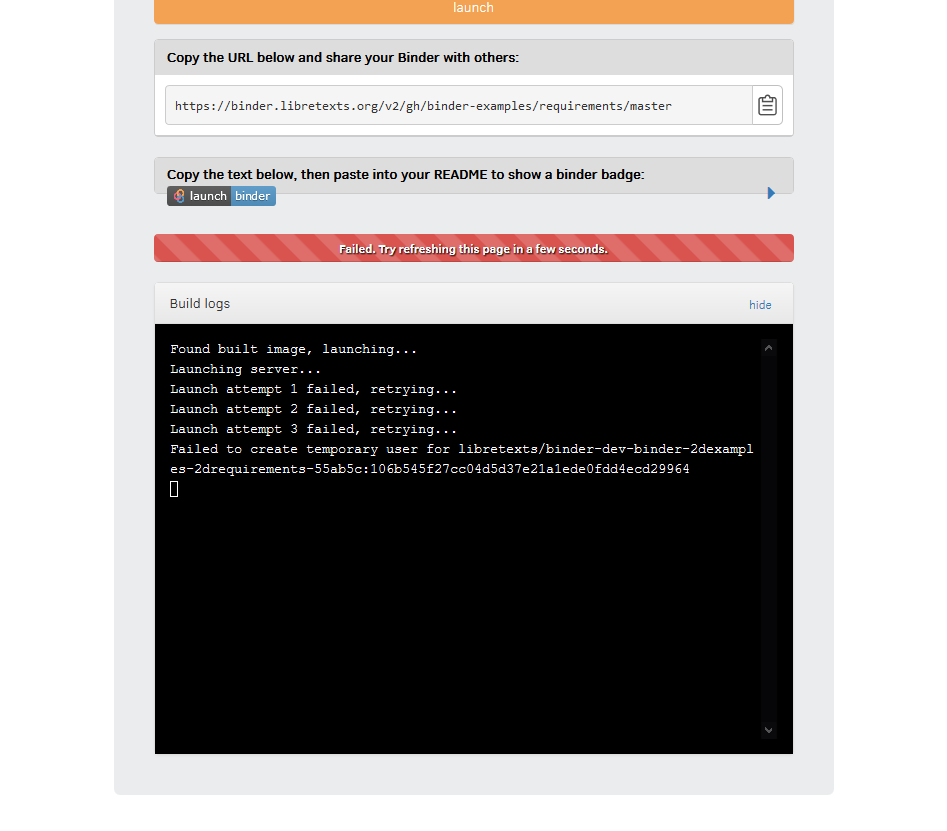
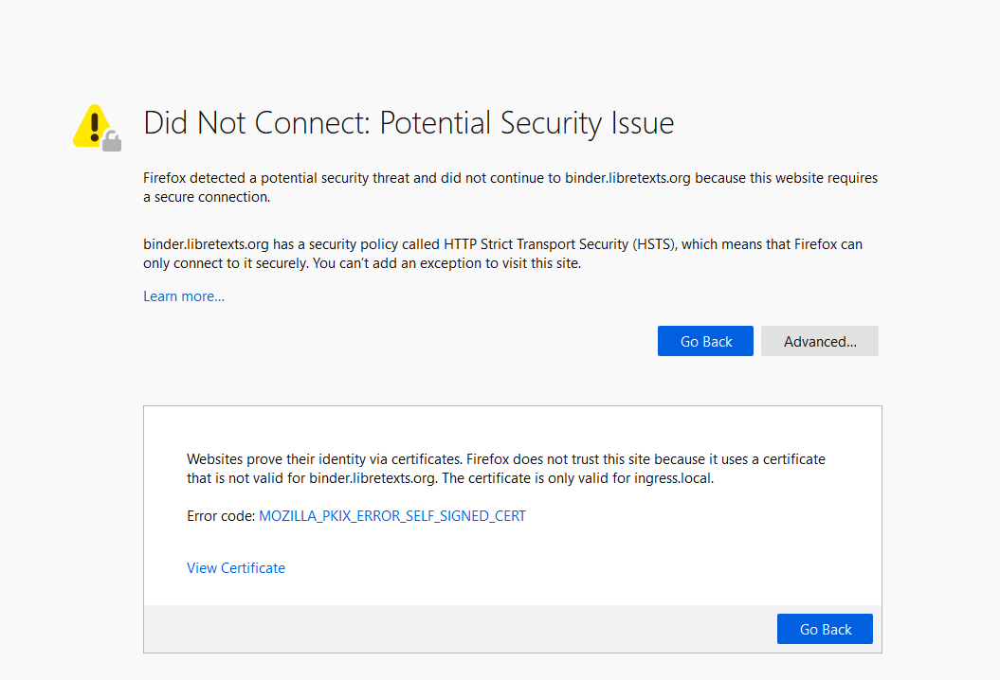

# BinderHub: Failure to launch new servers and HTTPS Issues

## Problem
### BinderHub server spawning
BinderHub was encountering failures on launching new servers. When trying
to spawn a server, BinderHub gave an error as shown below.



#### Some attempted solutions that did not succeed
* Upgrading BinderHub through Helm
* Deleting the BinderHub pods to force respawns (including `binder-xxx`,
  `hub-xxx`, `proxy-xxx`, and `user-scheduler-xxx`)
* Deleting `nfs-client-release-nfs-client-provisioner-xxx` (under the
  namespace `default`) to force respawn

#### Some solutions that we did not try
* Resetting/redeploying NFS configurations; I was afraid that doing this
  would mess with the current NFS volumes on JupyterHub

Unfortunately, we could not find a solution to this problem other than
uninstalling and reinstalling BinderHub, which came with its own set of
problems.

### BinderHub HTTPS error
After uninstalling Binderhub with `uninstall.sh` and attempting to
reinstall the newest development release with `install.sh`, the pods seemed
to become recreated as normal. However, when trying to access BinderHub,
one would receive this error:



#### Some attempted solutions that did not succeed (other than the ones mentioned above)
* Deleting the `autohttps-xxx` pod to force respawn
* Updating `binderhub-issuer.yaml`, a configuration file used to create the
  HTTPS certificate for BinderHub

## Solution

### Short version
* Uninstall BinderHub, then reinstall BinderHub. 
* Delete the cert-manager pod
* Open up port 80 on `binderhub.libretexts.org` and `binder.libretexts.org`
  so the JupyterHub underneath BinderHub could get HTTPS (almost identical
  solution to [HTTPSonJupyterHub.md](../baremetal.mdHTTPSonJupyterHub.md))
* Check certificate management progress using `kubectl get certificates -A`
  and `kubectl get secrets -A`. 
* Wait ~10-15 minutes for the certificate to generate.

### Long version
1. Uninstall BinderHub, then reinstall BinderHub.
   ```
   $ ./uninstall.sh
   $ ./install.sh
   ```

1. Delete the cert-manager pod (`cert-manager-xxxxxxxxx` under the
   cert-manager namespace). It will recreate itself since it’s in a
   ReplicaSet.

   **Side note:** 
   > Our deployment roughly follows this documentation on BinderHub:
   https://binderhub.readthedocs.io/en/latest/https.html#cert-manager-for-automatic-tls-certificate-provisioning
   While we roughly follow the BinderHub guidelines, we used an older form
   of documentation in which does not reflect our current configuration:
   ```
   apiVersion: certmanager.k8s.io/v1alpha1
   kind: ClusterIssuer
   metadata:
   name: letsencrypt-production
   namespace: binderhub
   spec:
   acme:
   # You must replace this email address with your own.
   # Let's Encrypt will use this to contact you about expiring
   # certificates, and issues related to your account.
   email: <email>
   server: https://acme-v02.api.letsencrypt.org/directory
   privateKeySecretRef:
   # Secret resource used to store the account's private key.
   name: <something here>
   http01: {}

   ```


1. BinderHub utilizes the ACME certificate manager, which issues TLS
   certificates. The issuer in the Kubernetes cluster comes in the form of
   Kubernetes resources called `Issuers` or `ClusterIssuers` ([more
   information here](https://cert-manager.io/docs/concepts/issuer/)), which
   are certificate authorities. An `Order` represents a request for a
   certificate. [Each `Order` therefore creates a
   challenge](https://cert-manager.io/docs/concepts/acme-orders-challenges/).
   

   Each certificate is based on a secret, generated for the certificate.

   Check if your certificate/secret is generated.
   ```
   $ kubectl get secret -A 
   NAMESPACE         NAME                                                       TYPE                                  DATA   AGE
   binderhub         binderhub-image-cleaner-token-mppk2                        kubernetes.io/service-account-token   3      14d

   $ kubectl get certificates -A
   NAMESPACE      NAME                               READY   SECRET                             AGE
   binderhub      binder.libretexts.org-tls          False    binder.libretexts.org-tls            9m

   $ kubectl describe certificate binder.libretexts.org-tls -n binderhub
   ...
   Status:
     Presented:   true
     Processing:  true
     Reason:      **Waiting for http-01 challenge propagation: wrong status code '404', expected '200'**
     State:       pending
   Events:        <none>
   ```

1. In this case, the certificate manager could not generate the certificate
   because port 80 was closed. Port 80 must be open in order for the
   certificate manager to complete the challenge and verify that you own
   the domain and are requesting the certificate. This is a very similar
   solution to [HTTPSonJupyterHub.md](../baremetal.mdHTTPSonJupyterHub.md).

   In our cluster, this is done by temporarily tweaking our nginx
   configuration.

   Adding the following allows requests sent to `binder.libretexts.org`
   through port 80 to be forwarded to the ingress controller at
   `10.0.1.61`.
   ```
   $ vim /etc/nginx/tcpconf.d/lb

   server {
      listen 128.120.136.56:80; # IP of binderhub.libretexts.org
      proxy_pass 10.0.1.61:80;
   }
   ```

   Commenting out the following disables the error that users usually
   receive when trying to access the site through port 80.
   ```
   $ vim /etc/nginx/nginx.conf

   # server {
   #         listen 128.120.136.56:80;
   #   server_name binder.libretexts.org;
   #   return 301 https://$server_name$request_uri;
   # }
   ```

   Run `sudo nginx -t` to check for linting errors, then `sudo systemctl
   restart nginx.service` to restart the nginx.

   Wait for ~10-15 minutes for the certificate to generate! We switched our
   nginx configuration from a correct to incorrect setup, which made the
   troubleshooting a bit longer than it should have.

1. After a successful update, your certificate should now look like this:
   ```
   $ kubectl describe certificate binder.libretexts.org-tls -n binderhub

   Status:
     Conditions:
       Last Transition Time:  2020-04-07T05:35:09Z
       Message:               Certificate is up to date and has not expired
       Reason:                Ready
       Status:                True
       Type:                  Ready
     Not After:               2020-07-06T04:35:09Z
   Events:                    <none>
   ```

## Resources
* https://cert-manager.io/docs/faq/acme/
* https://cert-manager.io/docs/configuration/acme/
