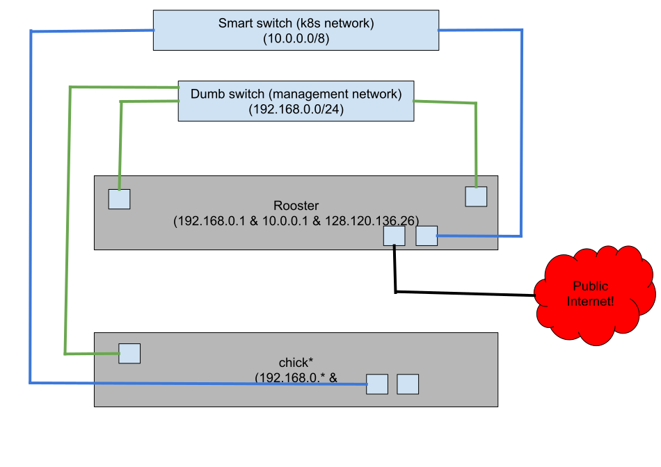

# Hardware

where we will put all our hardware setup info

## Networking

Here is our basic setup for the nodes (not pods yet): 
(taken from LibreTexts/Documentation/network_drawing as a saved svg)

### k8s network (internal network)

This is how all the computers will communicate with each other using kubernetes and how they will
access the internet indirectly though the manager. The manager will be a load balancer, dhcp server,
router with NAT, and our way assign IP addresses to services.

blue ethernet cables. Plugged into the smart switch.

manager is at 128.120.136.26

enp1s0 on all the machines (the one on the left but not the far left) except
the manager has it on enp3s0 which is the one as shown in the diagram above.

log into the switch with `screen /dev/ttyS0` on the management node
  - use username: manager
        password: friend

#### Meeting the k8s [Network Policy](https://kubernetes.io/docs/concepts/services-networking/network-policies/)

To do this we are trying to use Calico because it is faster than flannel. Alternatively, we could do it by hand
like is done in [k8s the hard way](https://github.com/kelseyhightower/kubernetes-the-hard-way/blob/master/docs/11-pod-network-routes.md)

### Management Network

We will have one management node and one dumb switch for this network. The management node
will connect to it on its enp2s0(the ethernet port on the right) and its management
interface (the one all the way to the left next to the usb ports).
It will run a DHCP server on this network.
The rest of the nodes will connect to this dumb switch only on their management interface.

Use green ethernet cables.
